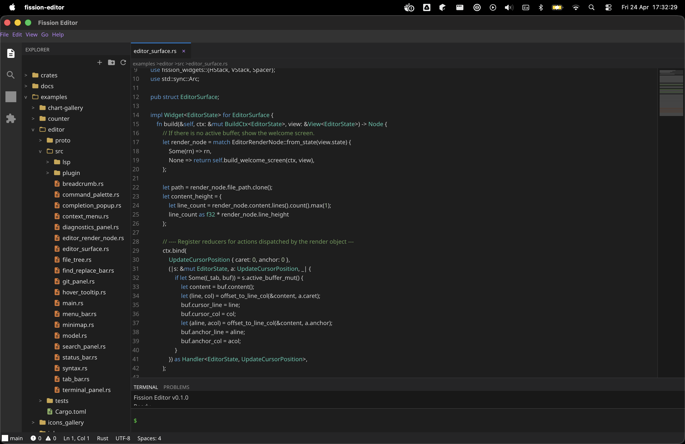
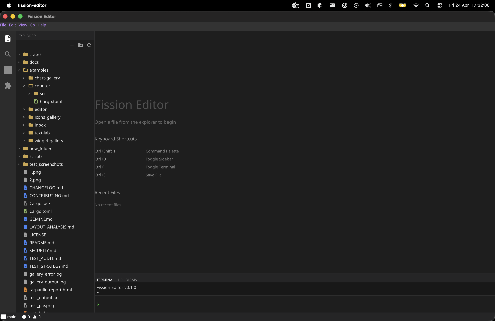

# Fission

**A cross-platform UI framework for Rust**

[](https://crates.io/crates/fission)
[](https://docs.rs/fission)
[](https://github.com/user/fission/actions/workflows/ci.yml)
[](LICENSE)

---

Fission is a GPU-accelerated, widget-based UI framework for Rust. It draws
inspiration from Flutter's build/layout/paint architecture while embracing
Rust's type system to deliver deterministic state management, serializable
action traces, and headless testability out of the box. Rendering is powered by
[Vello](https://github.com/linebender/vello) and
[wgpu](https://github.com/gfx-rs/wgpu), giving you high-performance 2D (and
optional 3D) graphics on every platform that wgpu supports.

## Key Features

- **GPU-accelerated rendering** -- Vello + wgpu backend with a trait-based
  renderer interface (Skia backend is also scaffolded).
- **Widget-based architecture** -- Flutter-inspired `build` / `layout` / `paint`
  pipeline. Widgets are plain Rust structs; no closures in the tree.
- **Deterministic state management** -- Actions are serializable descriptors,
  reducers are pure functions, and effects are explicit. Every state transition
  is replayable.
- **Rich widget library** -- 50+ ready-made widgets including buttons, text
  inputs, modals, popovers, menus, tabs, drawers, calendars, date pickers,
  data tables, charts, tree views, drag-and-drop, and more.
- **Theming and i18n** -- First-class theme tokens and internationalization
  support baked into the core.
- **Accessibility** -- Semantic roles, labels, and focus traversal are mandatory
  for interactive elements, with mappings to platform accessibility APIs.
- **Charts** -- A dedicated charting crate for data visualization widgets.
- **3D integration** -- Embed wgpu-based 3D scenes as first-class widgets.
- **Text engine** -- Rope-backed text engine (`ropey`) for efficient large-document editing.
- **Desktop shell** -- Native macOS, Linux, and Windows support via `winit`.
- **Mobile shell** -- Planned.
- **Web shell** -- Planned.
- **Diagnostics** -- Structured, zero-cost-when-disabled diagnostic events for
  profiling and debugging.
- **Testing infrastructure** -- Headless test harness with selectors, geometry
  assertions, action assertions, structural snapshots, and golden-image pixel
  tests. A remote test driver enables CI-friendly E2E testing.

## Architecture Overview

```
Widget::build()
    |
    v
Authoring Node tree  (open-world: any Widget can participate)
    |
    v
Lower to Core IR     (closed-world: fixed set of structural, layout,
    |                  paint, input, scroll, and embed ops)
    v
Layout pass          (constraint propagation, flex, scroll, baselines)
    |
    v
Paint / Display list (deterministic paint order, PaintMap)
    |
    v
Renderer             (Vello/wgpu rasterization)
```

The framework enforces a strict separation between the **authoring layer**
(widgets, macros, high-level API) and the **core layer** (IR, layout, semantics,
rendering). The authoring layer is intentionally open -- anyone can add new
widgets without modifying the core. The core IR is closed and versioned,
guaranteeing that layout and paint are deterministic across releases.

## Crate Map

| Crate | Path | Description |
|---|---|---|
| `fission` | `crates/authoring/fission` | Top-level re-export crate -- the main entry point for applications |
| `fission-core` | `crates/core/fission-core` | Runtime, widget trait, action dispatch, lowering, hit testing, state management |
| `fission-ir` | `crates/core/fission-ir` | Core intermediate representation -- the closed set of ops (structural, layout, paint, input, scroll, embed) |
| `fission-layout` | `crates/core/fission-layout` | Layout engine -- constraint propagation, flex, scroll, baselines |
| `fission-semantics` | `crates/core/fission-semantics` | Accessibility semantics -- roles, labels, actions, focus order |
| `fission-theme` | `crates/core/fission-theme` | Theme token definitions and resolution |
| `fission-i18n` | `crates/core/fission-i18n` | Internationalization and locale support |
| `fission-text-engine` | `crates/core/fission-text-engine` | Rope-backed text editing engine (built on `ropey`) |
| `fission-3d` | `crates/core/fission-3d` | 3D scene embedding via wgpu |
| `fission-widgets` | `crates/authoring/fission-widgets` | Rich widget library (50+ components) |
| `fission-macros` | `crates/authoring/fission-macros` | Proc macros (`#[derive(Action)]` and friends) |
| `fission-icons` | `crates/authoring/fission-icons` | Icon set with build-time code generation |
| `fission-charts` | `crates/authoring/fission-charts` | Chart and data-visualization widgets |
| `fission-render` | `crates/rendering/fission-render` | Renderer trait and display-list definitions |
| `fission-render-vello` | `crates/rendering/fission-render-vello` | Vello/wgpu renderer implementation |
| `fission-render-skia` | `crates/rendering/fission-render-skia` | Skia renderer implementation (experimental, not compiled by default) |
| `fission-shell` | `crates/shell/fission-shell` | Platform shell trait -- windowing, input, lifecycle |
| `fission-shell-desktop` | `crates/shell/fission-shell-desktop` | Desktop shell (macOS/Linux/Windows via `winit`) |
| `fission-shell-mobile` | `crates/shell/fission-shell-mobile` | Mobile shell (planned) |
| `fission-shell-web` | `crates/shell/fission-shell-web` | Web shell (planned) |
| `fission-diagnostics` | `crates/tools/fission-diagnostics` | Structured diagnostic events with zero-cost-when-disabled feature gate |
| `fission-test` | `crates/tools/fission-test` | Headless test harness -- selectors, assertions, snapshots |
| `fission-test-driver` | `crates/tools/fission-test-driver` | Remote test driver for E2E / CI testing |

## Screenshots

> Beloew are screenshots of apps built with Fission. Checkout the examples folder to see their code



<!--  -->
<!--  -->
<!--  -->
<!--  -->

## Quick Start

Add Fission to your project:

```toml
[dependencies]
fission = "0.1"
fission-core = "0.1"
fission-widgets = "0.1"
fission-macros = "0.1"
fission-shell-desktop = "0.1"
```

A minimal counter application:

```rust
use fission_core::action::ActionId;
use fission_core::ui::{Button, Column, Node, Text, TextContent};
use fission_core::{AppState, BuildCtx, Handler, ReducerContext, View, Widget};
use fission_macros::Action;
use fission_shell_desktop::DesktopApp;
use serde::{Deserialize, Serialize};

// 1. Define your application state.
#[derive(Default, Debug, Clone, PartialEq, Serialize, Deserialize)]
struct CounterState {
    value: i32,
}
impl AppState for CounterState {}

// 2. Define actions as serializable structs.
#[derive(Action, Serialize, Deserialize, Debug, Clone, PartialEq, Eq)]
struct Increment;

// 3. Write a pure reducer.
fn on_increment(
    state: &mut CounterState,
    _action: Increment,
    _ctx: &mut ReducerContext<CounterState>,
) {
    state.value += 1;
}

// 4. Build your widget tree.
struct CounterApp;

impl Widget<CounterState> for CounterApp {
    fn build(&self, ctx: &mut BuildCtx<CounterState>, view: &View<CounterState>) -> Node {
        Column {
            children: vec![
                Text {
                    content: TextContent::Literal(format!("Count: {}", view.state.value)),
                    font_size: Some(24.0),
                    ..Default::default()
                }
                .into(),
                Button {
                    on_press: Some(ctx.bind(
                        Increment,
                        on_increment as Handler<CounterState, Increment>,
                    )),
                    child: Some(Box::new(
                        Text {
                            content: TextContent::Literal("Increment".into()),
                            ..Default::default()
                        }
                        .into(),
                    )),
                    ..Default::default()
                }
                .into(),
            ],
            ..Default::default()
        }
        .into()
    }
}

// 5. Launch.
fn main() -> anyhow::Result<()> {
    DesktopApp::new(CounterApp).run()
}
```

## Building from Source

### Prerequisites

- **Rust** nightly toolchain (the project uses edition 2021; a recent nightly is
  recommended for full feature support).
- **System dependencies** for wgpu/Vello:
  - **macOS**: Xcode command-line tools.
  - **Linux**: `libwayland-dev`, `libxkbcommon-dev`, `libvulkan-dev` (or
    equivalent for your distro).
  - **Windows**: A Vulkan-capable GPU driver; the Windows SDK is also
    recommended.

### Build

```bash
git clone https://github.com/worka-ai/fission.git
cd fission
cargo build
```

### Run Tests

```bash
cargo test --workspace
```

## Running Examples

The repository ships several example applications:

| Example | Description |
|---|---|
| `counter` | Minimal counter with text input, checkbox, modal, animations, and canvas drawing |
| `widget-gallery` | Showcase of the full widget library |
| `chart-gallery` | Chart and data-visualization demos |
| `icons_gallery` | Browse the bundled icon set |
| `inbox` | Email-client-style demo with complex layout and state |
| `editor` | Text editor with syntax highlighting |
| `text-lab` | Text engine experimentation playground |

Run any example with:

```bash
cargo run -p counter
cargo run -p widget-gallery
cargo run -p inbox
```

## Project Structure

```
fission/
  crates/
    authoring/          High-level, user-facing crates
      fission/            Top-level re-export
      fission-widgets/    Widget library
      fission-macros/     Proc macros
      fission-icons/      Icon set
      fission-charts/     Chart widgets
    core/               Low-level, deterministic core
      fission-core/       Runtime and widget infrastructure
      fission-ir/         Core intermediate representation
      fission-layout/     Layout engine
      fission-semantics/  Accessibility semantics
      fission-theme/      Theming
      fission-i18n/       Internationalization
      fission-text-engine/ Text editing engine
      fission-3d/         3D scene embedding
    rendering/          Renderer implementations
      fission-render/     Renderer trait
      fission-render-vello/ Vello backend
      fission-render-skia/  Skia backend (experimental)
    shell/              Platform integration
      fission-shell/      Shell trait
      fission-shell-desktop/ Desktop (winit)
      fission-shell-mobile/  Mobile (planned)
      fission-shell-web/     Web (planned)
    tools/              Developer tooling
      fission-diagnostics/  Diagnostic events
      fission-test/         Test harness
      fission-test-driver/  Remote test driver
  examples/             Example applications
  docs/                 Design documents and specifications
```

## Contributing

Contributions are welcome. Please read [CONTRIBUTING.md](CONTRIBUTING.md) before
opening a pull request.

## License

Fission is licensed under the [MIT License](LICENSE).
